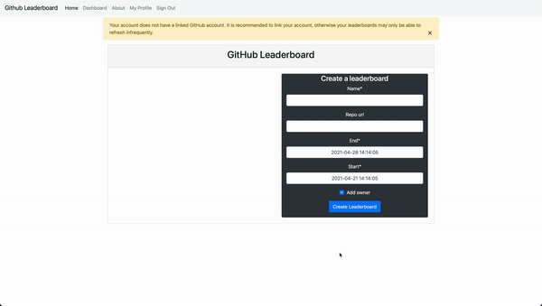
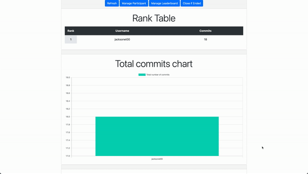

# Github Leaderboard

A Django-based web application that allows users to log in with their GitHub accounts, pull commit data from GitHub repositories, and rank participants based on the number of commits. This project is built using Docker and deployed on Heroku.

- [Application is deployed at Heroku.](https://fierce-shore-14743.herokuapp.com/)

## Features
- Login via GitHub OAuth: Users can authenticate using their GitHub credentials.
- Commit Tracking: Fetch commits from GitHub repositories and rank users based on their contributions.
- Leaderboard: Displays the ranking of participants based on their commit count.
- Admin Panel: Manage the database, users, and GitHub settings via Django’s built-in admin interface.


## Demo





## Developer Usage Documentation

[The project is setup with cookiecutter and docker so follow this link.](https://cookiecutter-django.readthedocs.io/en/latest/developing-locally-docker.html)
The following instructions is the bare minimal to get things running. Important configuration instructions is included
in the link.

Important locations are `config` which contains top level information about Django like routing for homepage and
installed apps. `requirements` contain the Python packages that Docker uses. `compose` is for
Docker. `github_leaderboard` contains all the Django files that you would modify.

### Installation
Follow these steps to set up the application locally.
Prerequisites:
-    Docker & Docker Compose installed
-   Python 3.8+ (optional, for local virtual environment setup)

1. Clone the Repository
```bash
git clone https://github.com/username/github-leaderboard.git
cd github-leaderboard
```
2. Setup pre-commit hooks

   This runs pre-commit before you commit with flake8 and black autoformatting. If you have flake8 errors,
the code will fail to commit.

```bash
python -m venv .venv
source .venv/bin/activate
pip install pre-commit
pre-commit install
```

3. Setup docker environment from our project dependencies

   1. Build the docker containers

   ```bash
   docker-compose -f local.yml build
   ```

   2. If in production, we can easily change things by running the production setting files.

   ```bash
   docker-compose -f production.yml build
   ```

### Add a new dependency to the project

1. Save the dependency to the requirements file. Note we have two different files `local.txt` and `production.txt` for
   the two environments. Remember to add the right dependency to the right file

   ```bash
   # Local dependency
   echo "<DEPENDENCY_NAME>==<VERSION_NUMBER>" >> requirements/local.txt
   # Production dependency
   echo "<DEPENDENCY_NAME>==<VERSION_NUMBER>" >> requirements/production.txt
   ```

2. Add the dependency to Django by modifying the `INSTALLED_APPS` array within the `config/settings/local.py`
   or `config/settings/production.py` file

### Manage database from admin panel

1. Ensure server is running
2. Add a superusername with the `manage.py` as detailed below. Since you are running local Postgres instances, you add
   your own superuser identity.
3. Visit `localhost:8000/admin` and login with that.

### Modify tables from `github_leaderboard/app/models.py`

1. Update schema
2. Ensure server is not running
3. Create migrations for new schema

   ```bash
   docker-compose -f local.yml run --rm django python manage.py makemigrations
   ```

4. Migrate database

   ```bash
   docker-compose -f local.yml run --rm django python manage.py migrate
   ```

If typing out the docker command is a pain, just alias
with `alias docker_django="docker-compose -f local.yml run --rm django python manage.py"`

### Create new database administrator account

1. Create a new superuser

   ```bash
   docker-compose -f local.yml run --rm django python manage.py createsuperuser
   ```

2. Log in through the admin panel

### Run Django pytest in containers

```bash
docker-compose -f local.yml run --rm django pytest
```

### Adding github auth

[Follow this guide mostly. Scroll to the bottom half that explains adding github oath application.](https://kodnito.com/posts/django-authentication-github/)
Do not use `localhost` for things. It breaks github redirect.

1. Go your `Github` account and go to `Settings/Developer Settings`

1. Go to `OAuth Apps` and click to `New OAuth App`

1. Change `Application name` to something like `Git Leaderboards`.
   Change `Homepage url` to `http://0.0.0.0:8000`.
   Change `Authorization callback URL` to `http://0.0.0.0:8000/accounts/github/login/callback`.

   Clearly you can change all of this for the production environment. Do not add an additional `/` to the end of
   callback url or you will get an error.

1. Save your `Cilent ID` and `Secret Key`. You need this for the Django app.

1. Go to admin page at `http://0.0.0.0:8000/admin` or the production url.

1. Go to `Sites` and add your `Domain Name` and `Display Name` to match your settings.
   `Domain Name` could be `0.0.0.0:8000` and `Display Name` could be w/e for local development.

1. Go to `Social Application` and click on `add`.

1. Select the `Provider` and change to `Github`. Add the `Github Leaderboard` to `Name`

1. Add your `Cilent ID` and `Secret Key` from when you saved `Github Leaderboard`

## Heroku deploying

To deploy this project on Heroku:
1. Install the Heroku CLI.
2. Log In
   ```bash
   heroku login
   ```
3. Create a new Heroku app:
   ```bash
   heroku create github-leaderboard
   ```
4. Push the code to Heroku:
   ```bash
   git push heroku main
   ```
5. Ensure that static files are handled by WhiteNoise, and follow the Heroku guide for more detailed instructions.

Note that `git push heroku master` should be `git push heroku main`.

## Project Design Documentation

User Table Explanation:

This project uses Django's default ```User``` table, extended with the ```ExtendedUser``` class to add GitHub-specific data and user roles. The ExtendedUser class has a one-to-one relationship with the default Django user model.

You can find this in the ```github_leaderboard/app/models.py``` file.
